Deep Learning + PyTorch — AI/ML Engineer Notes
0. Where we are in the roadmap

You can think of your journey as:

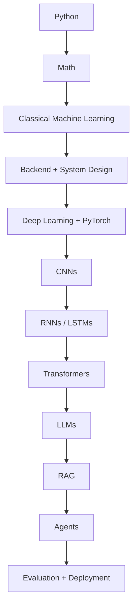
The goal of this section is not merely to train neural networks.

You should eventually be able to explain:

How does data enter a neural network, how does the network produce a prediction, how does it calculate its error, how does it learn from that error, and how do we implement the entire process in PyTorch?

PART 1 — What is Deep Learning?
1. Machine Learning vs Deep Learning

In traditional ML, we often have:

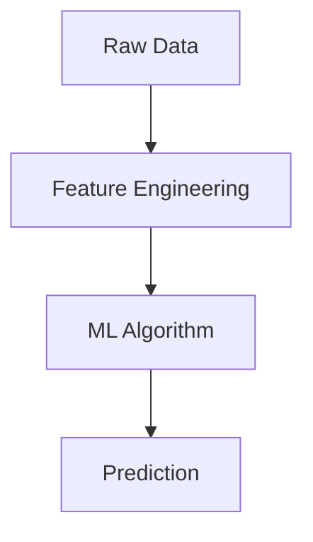

For example, predicting whether an email is spam:


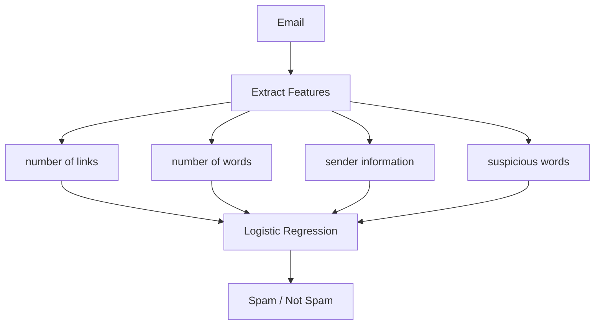

A human often decides what features are useful.

Deep learning tries to learn useful representations automatically.

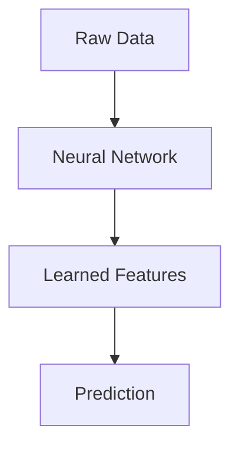

For an image:

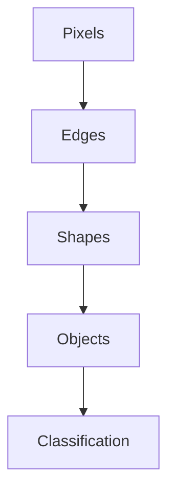

The network learns these representations from data.

PART 2 — Neural Networks 


> **Predict whether a student will pass based on hours studied and attendance.**

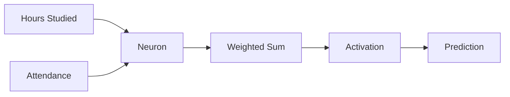

---

# 1. Input — What enters the neural network?

We first give the network some data.

Suppose one student has:

```text
Hours studied = 5
Attendance = 80%
```

So our input is:

$$
X = [5,80]
$$

But usually, before giving data to a neural network, we **scale/normalize** features so that values have reasonable ranges.

For example:

```text
Hours studied = 5      → 0.5
Attendance = 80%       → 0.8
```

So the network might receive:

$$
X=[0.5,0.8]
$$

These numbers are simply the **input features**.

The neural network doesn't understand the concept of "hours studied" or "attendance" like a human does. It just receives numbers.

---

# 2. Weights — How important is each input?

Now the neuron needs to decide how strongly each input should affect its calculation.

That's what **weights** do.

Suppose initially:

```text
Hours studied → weight = 0.4
Attendance    → weight = 0.7
```

The network calculates:

$$
x_1w_1+x_2w_2
$$

So:

$$
(0.5)(0.4)+(0.8)(0.7)
$$

$$
=0.2+0.56
$$

$$
=0.76
$$

The important thing:

**We did NOT manually choose these final weights.**

Initially, the weights are automatically initialized, usually with small values.

During training, the network keeps changing them.

Eventually it might discover something like:

```text
Hours studied → 0.8
Attendance    → 0.5
```

if that combination helps make better predictions.

So you can think:

> **Weights are the numbers the neural network learns to determine how strongly different inputs influence its output.**

---

# 3. Bias — Why is it needed?

After multiplying the inputs by their weights, we add a **bias**.

Suppose:

```text
bias = 0.1
```

Our calculation becomes:

$$
z=x_1w_1+x_2w_2+b
$$

Therefore:

$$
z=(0.5)(0.4)+(0.8)(0.7)+0.1
$$

$$
z=0.86
$$

Why have a bias?

Because without bias, the neuron is restricted in where its function can operate.

Bias gives the neuron an additional adjustable value that lets it **shift the result**.

A simple way to think about it:

```text
weights → control the influence of inputs
bias    → provides an additional adjustable offset
```

And just like weights, **bias is learned during training**.

---

> So What is a Neural Network? 
A neural network is a model that learns a relationship between inputs and outputs by passing data through multiple layers of neurons, where each neuron performs calculations using learned weights and biases.

Let's break that down.

Suppose we want to predict whether a student will pass:

Hours studied 
Attendance                 
Previous marks 

The neural network doesn't initially know how important each input is.

It has weights that determine their importance.

For example:

Hours studied     → weight = 0.8
Attendance        → weight = 0.5
Previous marks    → weight = 0.3

The neuron calculates:

$$ z = x_1w_1 + x_2w_2 + x_3w_3 + b $$

Then an activation function is applied:

$$ output = f(z) $$

During training, the network keeps changing the weights and biases so that its predictions become better.


> 1. Who determines the initial weights?

>The model itself doesn't know the correct weights initially. When we create a neural network, the weights are usually initialized automatically with small random values using an initialization method such as Xavier/Glorot or He initialization.

For example:

Initially:

w1 = 0.12
w2 = -0.03
w3 = 0.08

These are just starting points

>Then during training:
During training, the model starts with initially assigned weights and biases. It takes the input and calculates a weighted sum, then passes the result through an activation function. This produces the model's prediction. The prediction is compared with the actual value using a loss function to calculate the loss. Then, through backpropagation, we calculate the gradient of the loss with respect to each weight, which tells us how much the loss changes when that weight changes. The optimizer then uses these gradients to update the weights, usually by moving them in the opposite direction of the gradient. This process is repeated over many batches and epochs, gradually improving the model's predictions.

# 4. Weighted Sum — What did we just calculate?

The calculation:

$$
z=x_1w_1+x_2w_2+b
$$

is called the **linear transformation** or weighted sum.

Our neuron has now calculated:

$$
z=0.86
$$

But we're not finished.

The neuron now passes this value through an **activation function**.

---

# 5. Activation Function — What does it actually do?

This is where many beginner explanations become confusing.

The activation function takes:

```text
0.86
```

and transforms it according to a particular mathematical function.

For example, ReLU:

$$
ReLU(x)=max(0,x)
$$

So:

```text
ReLU(0.86) = 0.86
```

If the neuron had calculated:

```text
z = -2
```

then:

```text
ReLU(-2) = 0
```

So:

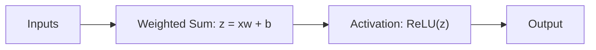

### But WHY do we need activation?

This is extremely important.

Imagine we have multiple layers:

```text
Input
 ↓
Layer 1
 ↓
Layer 2
 ↓
Layer 3
 ↓
Output
```

If every layer only performs:

$$
y=Wx+b
$$

with no activation function, then mathematically all those linear transformations can effectively be combined into **one linear transformation**.

So even if we have 100 layers, the network wouldn't gain the ability to represent genuinely complex nonlinear relationships.

Activation functions introduce **non-linearity**.

That allows the network to learn complicated patterns.

For example:

```text
Simple relationship
      ↓
Linear model can handle it

Complex relationship
      ↓
Neural network + nonlinear activations
      ↓
Can learn much more complicated patterns
```

---

# 6. Multiple neurons — Why not just one?

One neuron can only perform a relatively simple calculation.

So we put many neurons together.

For example:

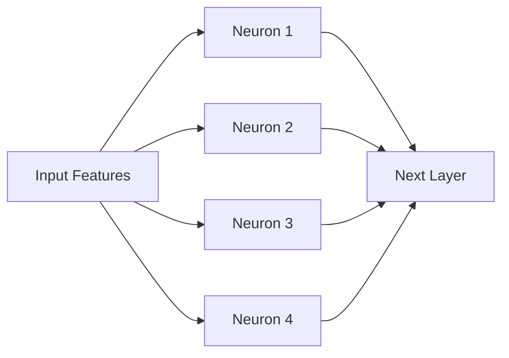

Each neuron has its **own weights and bias**.

Therefore, each neuron can learn a different pattern.

For example, conceptually:

```text
Neuron 1 → learns something related to studying
Neuron 2 → learns something related to attendance
Neuron 3 → learns interaction between them
Neuron 4 → learns another useful pattern
```

We don't tell the neurons what to learn.

The training process determines useful patterns through the learned parameters.

---

# 7. A layer

A group of neurons forms a **layer**.

For example:

```text
Input layer
     ↓
[Neuron] [Neuron] [Neuron] [Neuron]
     ↓
Hidden layer
```

A neural network typically has:

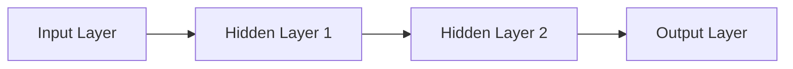

### Input layer

Receives the features.

Example:

```text
Hours studied
Attendance
Previous marks
```

### Hidden layers

Perform transformations and learn useful representations.

### Output layer

Produces the final output required by the task.

---

# 8. What does a hidden layer actually learn?

This is a very important idea.

Imagine an image classification network.

Initially:

```text
Pixels
 ↓
Layer 1
```

The first layers might learn relatively simple visual patterns:

```text
edges
corners
textures
```

Then:

```text
edges
 ↓
Layer 2
```

can combine them into:

```text
shapes
```

Then later:

```text
shapes
 ↓
Later layers
```

can represent:

```text
eyes
ears
wheels
faces
etc.
```

Finally:

```text
learned representations
 ↓
classification
```

The network isn't explicitly told:

> "This neuron should detect an ear."

The useful representations **emerge from training**.

---

# 9. Forward Pass — Putting everything together

Now we have the complete network.

When an input enters the network and travels from beginning to end, that's called the **forward pass**.

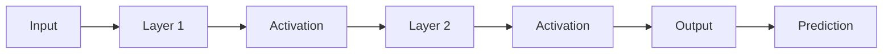

For every layer, the basic process is:

$$
z=Wx+b
$$

then:

$$
a=f(z)
$$

The output `a` becomes the input to the next layer.

So:

```text
Input
 ↓
Linear calculation
 ↓
Activation
 ↓
Linear calculation
 ↓
Activation
 ↓
Output
```

At the end, we get a prediction.

---

# 10. Prediction

Suppose our network is doing binary classification:

```text
Pass
Fail
```

The output might be:

$$
0.87
$$

We can interpret that as approximately:

```text
87% probability of Pass
```

depending on the model's output setup.

We could then use a threshold:

```text
prediction >= 0.5 → Pass
prediction < 0.5  → Fail
```

But **the exact output setup depends on the architecture and loss function**.

---

# 11. But how does the network know whether it is correct?

This is where **loss** comes in.

Suppose:

```text
Actual answer = Pass
Model prediction = 0.87
```

That's a pretty good prediction.

But suppose:

```text
Actual answer = Pass
Model prediction = 0.12
```

That's terrible.

We need a numerical measure of how bad the prediction is.

That's the **loss function**.

---

# 12. Loss Function

The loss function takes:

```text
Actual answer
+
Model prediction
```

and produces a number representing the error.

Conceptually:

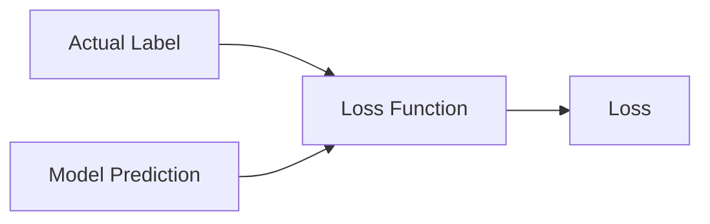

For example:

```text
Good prediction → small loss
Bad prediction  → large loss
```

The goal of training is:

> **Make the loss as small as possible.**

---

# 13. Example of loss

Suppose:

```text
Actual = Pass
Prediction = 0.95
```

The model is confident and correct.

So:

```text
Loss → small
```

But:

```text
Actual = Pass
Prediction = 0.05
```

The model is confidently wrong.

So:

```text
Loss → large
```

This is why classification commonly uses **cross-entropy loss**.

---

# 14. Now comes the important question

We know:

```text
Prediction
 ↓
Loss
```

Suppose the loss is huge.

What should we change?

Remember that the prediction came from:

```text
weights
biases
```

So we need to figure out:

> **Which weights caused the loss, and in which direction should we change them?**

That's where **backpropagation** comes in.

---

# 15. Backpropagation

Backpropagation works **backwards through the network**.

Forward:

```text
Input
 ↓
Layer 1
 ↓
Layer 2
 ↓
Prediction
 ↓
Loss
```

Backward:

```text
Loss
 ↓
Layer 2
 ↓
Layer 1
 ↓
Gradients
```

The purpose is to calculate the **gradient of the loss with respect to each parameter**.

For example:

$$
\frac{\partial L}{\partial w_1}
$$

means:

> How much does the loss change if we change \(w_1\)?

---

# 16. What is a gradient?

Imagine you're standing on a mountain.

You want to go downhill.

The gradient tells you something about:

> **Which direction makes the value increase most quickly.**

So to reduce the loss, we generally move in the **opposite direction of the gradient**.

For a weight:

$$
w_{new}=w_{old}-\eta\frac{\partial L}{\partial w}
$$

where:

* \(w\) = weight
* \(L\) = loss
* \(\eta\) = learning rate

---

# 17. Where does backpropagation get those gradients?

Using the **chain rule**.

Suppose:

```text
w
 ↓
z
 ↓
activation
 ↓
prediction
 ↓
loss
```

The loss depends on the prediction.

The prediction depends on the activation.

The activation depends on `z`.

And `z` depends on `w`.

So calculus allows us to calculate:

$$
\frac{\partial L}{\partial w}
$$

by multiplying the appropriate derivatives along the path.

That's the mathematical foundation of backpropagation.

---

# 18. Optimizer

Now we have gradients.

But gradients themselves don't update the weights.

An **optimizer uses those gradients to update the parameters**.

Common optimizers:

```text
SGD
Adam
AdamW
```

Conceptually:

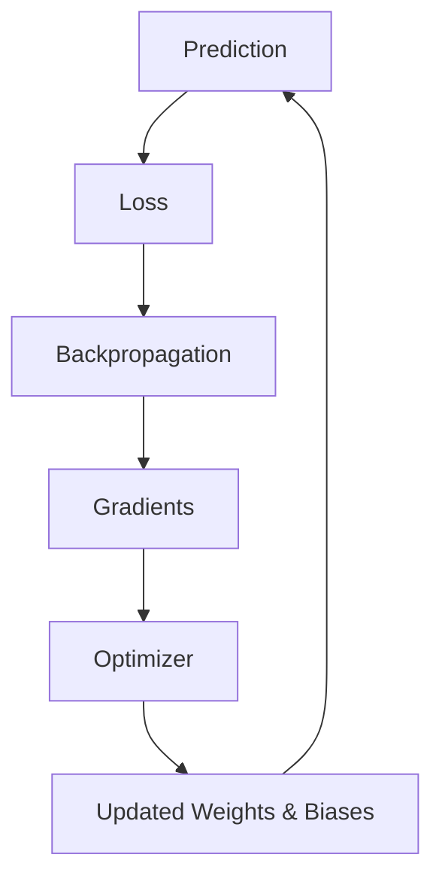

For simple gradient descent:

$$
w_{new}=w_{old}-\eta gradient
$$

---

# 19. Learning rate

The learning rate controls **how big the parameter update is**.

Suppose:

```text
current weight = 0.5
gradient = 0.2
learning rate = 0.1
```

Then:

$$
w_{new}=0.5-(0.1)(0.2)
$$

$$
w_{new}=0.48
$$

So the weight changed from:

```text
0.50 → 0.48
```

If the learning rate were much larger, the update would be much larger.

That's why choosing a good learning rate matters.

---

# 20. Then we repeat

This is the actual learning process.

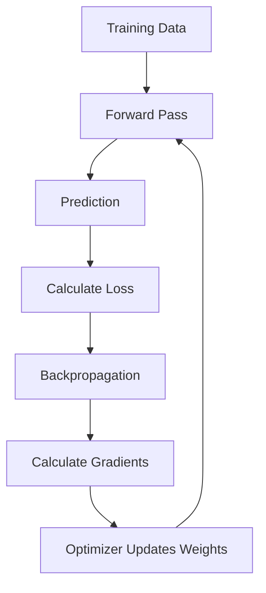

The network repeats this process **many times**.

Each update tries to make the model slightly better.

Over thousands or millions of updates, the weights can become very useful.

---

# 21. Where do epochs and batches fit?

Suppose you have:

```text
100,000 training examples
```

You usually don't give all 100,000 to the model at once.

Instead:

```text
Batch 1 → 64 examples
Batch 2 → 64 examples
Batch 3 → 64 examples
...
```

For each batch:

```text
forward
 ↓
loss
 ↓
backward
 ↓
update weights
```

After the model has processed all 100,000 examples once:

> **1 epoch is complete.**

Then you can start another epoch.

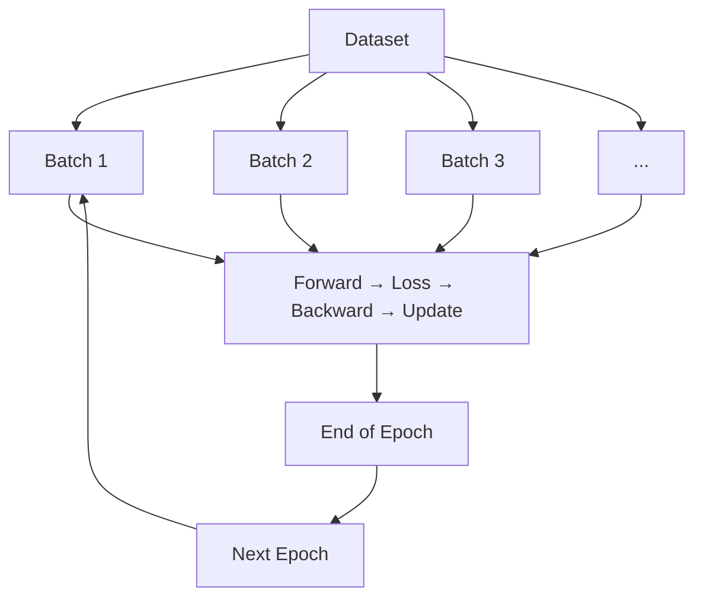

---

# 22. So WHO actually learns?

This is the key mental model.

The **architecture doesn't learn**.

The **activation function doesn't learn**.

The **optimizer doesn't learn the task by itself**.

The thing that gets learned is primarily the model's **parameters**:

```text
Weights
Biases
```

Training repeatedly changes these parameters based on the gradients.

So:

```text
                  Neural Network
                        │
             ┌──────────┴──────────┐
             ↓                     ↓
        Architecture           Parameters
       (chosen by us)          (learned)
             │                     │
       layers, neurons       weights, biases
       activations
```

---

# 23. One complete example

Let's put the entire story together.

Student:

```text
Hours studied = 5
Attendance = 80%
```

### Step 1 — Input

```text
[0.5, 0.8]
```

### Step 2 — Multiply by weights

```text
0.5 × w1
0.8 × w2
```

### Step 3 — Add them + bias

$$
z=x_1w_1+x_2w_2+b
$$

### Step 4 — Activation

$$
a=ReLU(z)
$$

### Step 5 — Continue through hidden layers

```text
Layer 1
 ↓
Layer 2
 ↓
Layer 3
```

Each layer performs similar transformations.

### Step 6 — Output

```text
Prediction = 0.87
```

### Step 7 — Compare with actual answer

Suppose:

```text
Actual = 1
```

where `1 = Pass`.

### Step 8 — Calculate loss

The loss function determines how wrong:

```text
prediction = 0.87
actual = 1
```

### Step 9 — Backpropagation

Calculate:

```text
How much did each weight contribute to the loss?
```

This produces gradients.

### Step 10 — Optimizer

Use gradients to modify:

```text
weights
biases
```

### Step 11 — Repeat

The same process happens for the next batch and eventually many epochs.

---

# 24. The entire thing in ONE diagram

This is the diagram I recommend keeping in your notes:

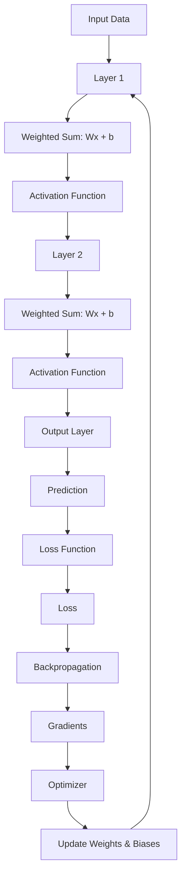

### The most important distinction:

**Forward pass:**

```text
Input → layers → prediction → loss
```

**Backward pass:**

```text
Loss → gradients
```

**Optimization:**

```text
Gradients → updated weights/biases
```

Then repeat.

---

## And this is exactly what PyTorch will automate for you

Later, when you see:

```python
optimizer.zero_grad()

output = model(x)

loss = criterion(output, y)

loss.backward()

optimizer.step()
```

you should now be able to mentally translate it as:

```text
zero_grad()
    ↓
clear old gradients

model(x)
    ↓
forward pass

criterion(...)
    ↓
calculate loss

loss.backward()
    ↓
backpropagation
    ↓
calculate gradients

optimizer.step()
    ↓
update weights and biases
```

**This is the foundation.** Once this is completely clear, `nn.Linear`, `nn.Module`, `DataLoader`, CNNs, and eventually Transformers will make much more sense rather than looking like unrelated PyTorch syntax.
